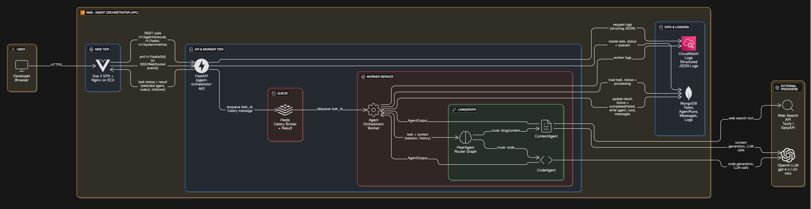
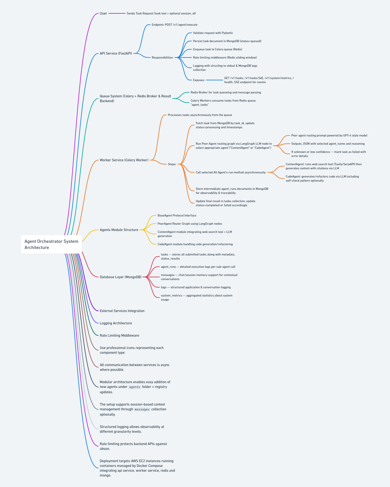
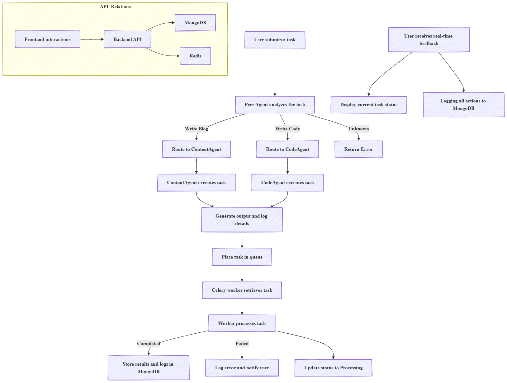
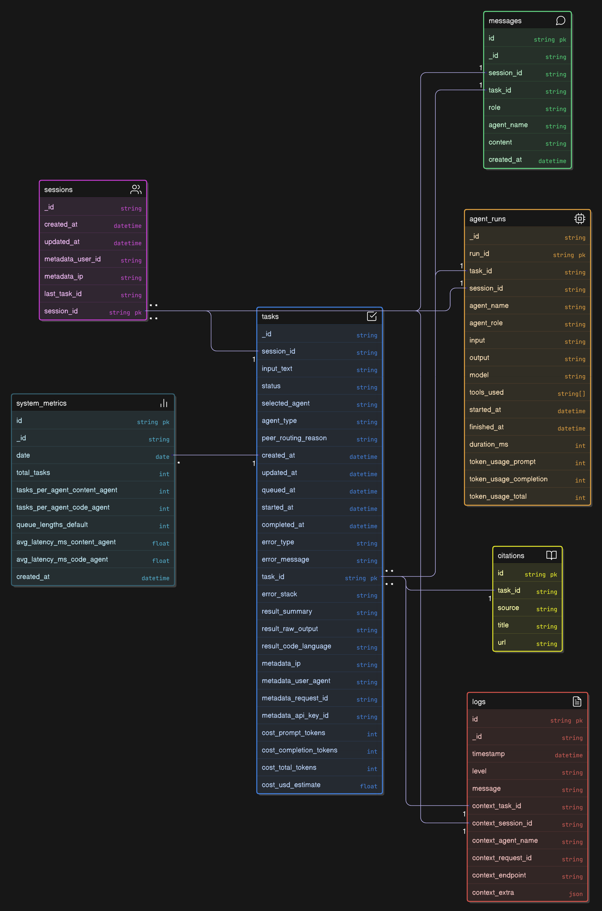
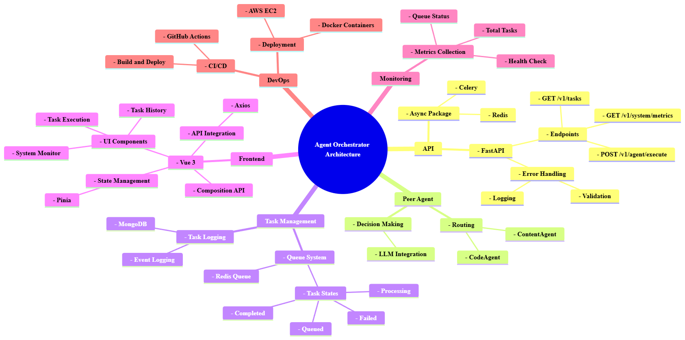

# Agent Orchestrator API

Backend service for **Agent Orchestrator** – an agentic, production-ready system that:

- Accepts free-form tasks from clients,
- Routes them via a **Peer Agent** (LLM-based router) to specialized sub-agents using **LangGraph**,
- Executes tasks asynchronously via **Celery + Redis** workers,
- Persists all task, routing, and conversation data in **MongoDB**,
- Exposes rich monitoring endpoints and SSE streams for real-time status.

This README is designed to be a **single source of truth** for:

- Architecture and design decisions,
- Setup and operations (local & AWS),
- API documentation,
- Queue, logging, metrics, and rate limiting details,
- All implemented **bonus features** for the technical test.

---

## Table of Contents

1. [High-Level Overview](#high-level-overview)  
2. [Architecture Diagrams](#architecture-diagrams)  
   - [System Architecture](#system-architecture-diagram)  
   - [Flow Architecture](#flow-architecture-diagram)  
   - [Flow Diagram (Runtime Sequence)](#flow-diagram-runtime-sequence)  
   - [ER / Data Model Diagram](#er--data-model-diagram)  
   - [Mind Map](#mind-map-diagram)  
3. [Technology Stack](#technology-stack)  
4. [12-Factor & Design Principles](#12-factor--design-principles)  
5. [Project Structure](#project-structure)  
6. [Configuration & Environment](#configuration--environment)  
7. [Core Concepts](#core-concepts)  
   - [Peer Agent Router (LangGraph)](#peer-agent-router-langgraph)  
   - [ContentAgent](#contentagent)  
   - [CodeAgent](#codeagent)  
   - [Session / Memory Model](#session--memory-model)  
8. [Data Model & Collections](#data-model--collections)  
9. [Queue & Worker Architecture](#queue--worker-architecture)  
10. [API Endpoints](#api-endpoints)  
    - [Authentication](#authentication)  
    - [POST /v1/agent/execute](#post-v1agentexecute)  
    - [GET /v1/tasks](#get-v1tasks)  
    - [GET /v1/taskstask_id](#get-v1taskstask_id)  
    - [GET /v1/taskstask_idevents-sse](#get-v1taskstask_idevents-sse)  
    - [GET /v1/system/metrics](#get-v1systemmetrics)  
    - [GET /health](#get-health)  
    - [GET /metrics](#get-metrics-prometheus)  
11. [Rate Limiting](#rate-limiting)  
12. [Logging & Observability](#logging--observability)  
13. [Tests & Quality](#tests--quality)  
14. [DevOps & AWS Deployment](#devops--aws-deployment)  
15. [AI Tooling & Prompt Engineering](#ai-tooling--prompt-engineering)  
16. [Bonus Features Checklist](#bonus-features-checklist)  
17. [Production Hardening & Future Work](#production-hardening--future-work)  
18. [Local Development & Runbook](#local-development--runbook)  

---

## High-Level Overview

**Goal:** Implement a **Peer Agent controlled task distribution** backend where:

1. A client sends a free-form `task` in natural language.
2. A **Peer Agent (router)**, implemented with **LangGraph + OpenAI**, classifies and decides which sub-agent should handle the task:
   - `ContentAgent` – for “blog / article / explanatory content” tasks.
   - `CodeAgent` – for “write / refactor / debug code” tasks.
3. The decision is **not keyword-based**; it is made by an LLM with explicit routing prompts and confidence thresholds.
4. The task is **queued** into `Celery` using **Redis**; a background worker:
   - Executes the LangGraph graph,
   - Calls the selected agent,
   - Writes outputs, costs, and logs into **MongoDB**,
   - Publishes **SSE events** via Redis Pub/Sub.
5. The client:
   - Immediately receives a `task_id` with status `queued`,
   - Can poll task details or subscribe to real-time events via SSE,
   - Can inspect system metrics via `/v1/system/metrics` and `/metrics`.

The system is **modular, extensible, and production-oriented**, following **12-Factor**, with a full **CI/CD pipeline** on AWS (ECR + EC2 + CodeDeploy + CloudWatch).

---

## Architecture Diagrams

All diagrams live under the `diagrams/` directory and are referenced here.

### System Architecture Diagram

`diagrams/system_architecture.png`



**Description**

The system architecture diagram shows the full deployment and runtime topology:

- **Client / Frontend** connects to `Agent Orchestrator API` over HTTPS.
- API runs on **FastAPI** behind an EC2 instance (optionally behind an ALB).
- The API pushes work to **Celery** using **Redis / Valkey (AWS ElastiCache)** as broker & result backend.
- A dedicated **Celery Worker** container consumes tasks.
- Both API and Worker talk to:
  - **MongoDB Atlas** (`agent-orchestrator-db`) for tasks, agent_runs, messages, sessions, logs.
  - **OpenAI** for LLM calls (router + agents).
  - **Tavily** for web search (ContentAgent).
- Observability:
  - Logs go to **stdout → CloudWatch Logs** (`/agent-orchestrator/api` & `/agent-orchestrator/worker`).
  - Metrics exposed via `/metrics` (Prometheus scrape).
- Configuration and secrets come from **ENV**, bound to **AWS SSM Parameter Store** in production.

---

### Flow Architecture Diagram

`diagrams/flow_architecture.png`



**Description**

This diagram focuses on the **logical flow** of a task:

1. **HTTP Request** → `POST /v1/agent/execute`.
2. **API Layer**:
   - Validates input (`ExecuteTaskRequest`),
   - Inserts a new record into `tasks` with status `queued`,
   - Enqueues a Celery job `process_task(task_id)`.
3. **Celery Worker**:
   - Loads task from Mongo,
   - Sets `status=processing`,
   - Invokes **PeerAgentRouter** (LangGraph):
     - `classify_task` node (LLM),
     - `route_to_agent` node (validation),
     - `execute_agent` node (ContentAgent / CodeAgent).
   - Persists:
     - Selected agent,
     - Peer routing reason,
     - Final result & citations,
     - Costs and token usage,
     - Agent run traces (router + executor) in `agent_runs`.
   - Emits **task events** into Redis Pub/Sub for SSE.
   - Sets `status=completed` or `failed`.
4. **Client**:
   - Polls `GET /v1/tasks/{task_id}`,
   - Or listens to `/v1/tasks/{task_id}/events` via EventSource (SSE).

---

### Flow Diagram (Runtime Sequence)

`diagrams/flow_diagram.png`



**Description**

Sequence-style diagram showing:

1. Client → API: `execute` request.
2. API → MongoDB: `insert task`.
3. API → Redis (Celery broker): `enqueue process_task`.
4. Worker → Redis: `consume process_task`.
5. Worker → MongoDB: `update status=processing`.
6. Worker → PeerAgent (LangGraph) → OpenAI:
   - Router classification call,
   - Sub-agent call (Content or Code).
7. Worker → Tavily (for ContentAgent) → incorporate results.
8. Worker → MongoDB: write `result`, `cost`, `agent_runs`.
9. Worker → Redis Pub/Sub: `publish task_events:<task_id>`.
10. Client:
    - SSE subscription receives `queued → processing → completed/failed`,
    - Polls detail endpoint as needed.

---

### ER / Data Model Diagram

`diagrams/er_diagram.png`



**Description**

The ER diagram models the major collections:

- `tasks`
  - 1 : N relationship to `agent_runs` (one task may produce multiple runs: router + executor + future tools).
  - 1 : N relationship to `messages` (all messages tied to the task and session).
  - Optional 1 : 1 relationship to `sessions` via `session_id`.
- `agent_runs`
  - Each record contains `task_id`, `session_id`, `agent_name`, `agent_role`, `token_usage`.
- `messages`
  - Holds conversation-like history: `role` (user/system/assistant/tool), `agent_name`, content.
- `sessions`
  - Manages cross-task continuity, with metadata and `last_task_id`.
- `logs`
  - Stores structured log snapshots for important events.
- `system_metrics`
  - Optional collection for pre-aggregated metrics (daily rollups).

This diagram makes it clear that **task** is the central entity, and everything else attaches to it.

---

### Mind Map Diagram

`diagrams/mind_map.png`



**Description**

The mind map illustrates:

- Core domains:
  - **API Layer** (FastAPI, routers)
  - **Agentic Logic** (PeerAgent, ContentAgent, CodeAgent, LangGraph)
  - **Data Layer** (MongoDB collections, repositories)
  - **Queue / Worker** (Celery, Redis)
  - **Observability** (logs, metrics, health, dashboards)
  - **DevOps** (CI/CD, AWS, Docker)
- Cross-cutting concerns:
  - Rate limiting,
  - Security (CORS, API keys),
  - 12-Factor config,
  - Testing and quality.
- Bonus features highlighted: SSE events, session/memory, Prometheus metrics, advanced prompt engineering.

The mind map is useful for newcomers to quickly understand the major pieces and how they fit together.

---

## Technology Stack

**Runtime**

- Python **3.12**
- FastAPI (async HTTP API)
- uvicorn (ASGI server; can be fronted by gunicorn in production)

**Agentic / AI**

- **LangGraph** for agent routing graph (PeerAgent).
- **OpenAI Python SDK** for LLM calls:
  - Peer router: `LLM_PEER_MODEL` (e.g. `gpt-4.1-mini`).
  - ContentAgent: `LLM_CONTENT_MODEL` (e.g. `gpt-4.1` / `gpt-4o`).
  - CodeAgent: `LLM_CODE_MODEL` (e.g. `o3-mini` / `gpt-4o`).
- **Tavily** search for web context in ContentAgent.

**Data & Queue**

- MongoDB Atlas (DB name: `agent-orchestrator-db`) – `motor` async driver.
- Redis / Valkey (AWS ElastiCache) as:
  - Celery broker and result backend,
  - Rate limiting store,
  - Pub/Sub bus for SSE.

**Infrastructure & DevOps**

- Docker & Docker Compose
- **uv** as Python package manager (`pyproject.toml`, `uv sync`)
- AWS:
  - EC2 for API + Worker containers,
  - ECR for container images,
  - CodeDeploy for deployments,
  - SSM Parameter Store for config & secrets,
  - CloudWatch Logs & metrics.

**Observability & Quality**

- structlog (JSON logs)
- prometheus-client (for `/metrics`)
- pytest / pytest-asyncio for tests
- ruff, black, mypy, flake8 for linting & typing (`.flake8` with `max-line-length=120`)

---

## 12-Factor & Design Principles

The service adheres to **12-Factor App**:

1. **Codebase** – single repo (`agent-orchestrator-api`).
2. **Dependencies** – fully declared in `pyproject.toml`, installed via `uv sync`.
3. **Config** – all configuration via environment variables, loaded by `Settings` (`app/core/config.py`).
4. **Backing services** – MongoDB, Redis, OpenAI, Tavily treated as attached resources.
5. **Build / release / run** – CI builds Docker images, CodeDeploy handles release & run.
6. **Processes** – API and Worker are stateless processes; state is in Mongo/Redis.
7. **Port binding** – FastAPI exposes HTTP on a port (`8000` by default).
8. **Concurrency** – scaled via more API containers and more Celery workers.
9. **Disposability** – fast startup/shutdown; Celery tasks are idempotent at task level.
10. **Dev/Prod parity** – same code & images across environments, only config differs.
11. **Logs** – write to stdout in JSON, aggregated by CloudWatch.
12. **Admin processes** – operational tasks can be run via ephemeral containers using the same image.

Design principles:

- **Separation of concerns** (API / services / repositories / agents / worker).
- **Modularity & extensibility** (AgentRegistry enables plugging new agents without touching API).
- **Strong typing** (Pydantic v2 & type hints across the codebase).
- **Defensive error handling** and graceful degradation (e.g., rate limit fails open when Redis is down in local/test).

---

## Project Structure

```text
agent-orchestrator-api/
  app/
    api/
      v1/
        routes_agent.py       # POST /v1/agent/execute
        routes_tasks.py       # GET /v1/tasks, GET /v1/tasks/{id}, SSE events
        routes_metrics.py     # GET /v1/system/metrics
        routes_health.py      # GET /health
    agents/
      base.py                 # BaseAgent protocol & AgentOutput
      peer_agent.py           # LangGraph router implementation
      content_agent.py        # ContentAgent (web search + LLM)
      code_agent.py           # CodeAgent (code generation LLM)
      registry.py             # AgentRegistry (modular agent mapping)
    core/
      config.py               # Pydantic Settings (env-based)
      debug.py                # Safe debug snapshot of settings
      logging.py              # structlog configuration
      errors.py               # AppError hierarchy + FastAPI handlers
      rate_limit.py           # Redis sliding-window rate limiter
      redis_client.py         # Shared async Redis client
      security.py             # CORS & API key verification
      utils.py                # UUID, timing, utc_now, helpers
    db/
      mongo.py                # Motor client, database bootstrap
      repositories/
        tasks_repo.py
        agent_runs_repo.py
        messages_repo.py
        logs_repo.py
        sessions_repo.py
    llm/
      base_client.py          # LLMResult / LLMUsage abstraction
      openai_client.py        # AsyncOpenAI wrapper
      tools/
        web_search_tool.py    # Tavily integration
    models/
      domain/
        task.py               # Task, TaskCreate, TaskUpdate, TaskResult, etc.
        agent_run.py          # AgentRun, TokenUsage
        message.py            # Message documents
        system_metrics.py     # SystemMetrics view model
        session.py            # Session model
      api/
        requests.py           # ExecuteTaskRequest, PaginationQuery
        responses.py          # ExecuteTaskResponse, TaskSummaryResponse, TaskDetailResponse, SystemMetricsResponse
        errors.py             # API error payload models
    services/
      task_service.py         # Task orchestration & repository glue
      metrics_service.py      # Aggregations for system metrics
      orchestration_service.py# Orchestrates PeerAgent + updates task
      session_service.py      # Session & message handling
    worker/
      celery_app.py           # Celery configuration (broker, backend)
      tasks.py                # process_task definition, SSE pub/sub
  tests/
    api/                      # API tests (happy path + edge)
    services/                 # Service layer tests
    agents/                   # PeerAgent routing tests
    worker/                   # Worker integration tests
  docker/
    Dockerfile.api
    Dockerfile.worker
    docker-compose.yml
  .github/
    workflows/
      ci-cd-backend.yml       # CI + build + deploy via CodeDeploy
  scripts/
    before_install.sh
    start_application.sh
    stop_application.sh
  diagrams/
    system_architecture.png
    er_diagram.png
    flow_architecture.png
    mind_map.png
    flow_diagram.png
  appspec.yml
  pyproject.toml
  uv.lock                     # optional lockfile
  .env                        # local only (not committed)
  .env.example
  .flake8
  README.md                   # this file
````

---

## Configuration & Environment

Configuration is managed via `app/core/config.py` using **Pydantic Settings**.

### Environment Variables

Key variables (see `.env.example`):

| Variable                 | Required | Description                                                      |
| ------------------------ | -------- | ---------------------------------------------------------------- |
| `ENVIRONMENT`            | Yes      | `local`, `dev`, or `prod`. Influences rate limiting etc.         |
| `APP_NAME`               | Yes      | Application name (used in logs & titles).                        |
| `LOG_LEVEL`              | Yes      | `DEBUG`, `INFO`, `WARNING`, `ERROR`.                             |
| `RATE_LIMIT_PER_MINUTE`  | Yes      | Global per-minute limit (IP/API key).                            |
| `MONGO_URI`              | Yes      | MongoDB connection URI.                                          |
| `MONGO_DB_NAME`          | Yes      | Database name (`agent-orchestrator-db`).                         |
| `REDIS_URL`              | Yes      | Redis/Valkey URL (ElastiCache endpoint in prod).                 |
| `REDIS_GLOBAL_KEYPREFIX` | No       | Global key prefix for Redis keys.                                |
| `CELERY_BROKER_URL`      | No       | Defaults to `REDIS_URL` if not set.                              |
| `CELERY_RESULT_BACKEND`  | No       | Defaults to `REDIS_URL` if not set.                              |
| `OPENAI_API_KEY`         | Yes      | OpenAI API key.                                                  |
| `LLM_PEER_MODEL`         | Yes      | Router model (e.g. `gpt-4.1-mini`).                              |
| `LLM_CONTENT_MODEL`      | Yes      | ContentAgent model.                                              |
| `LLM_CODE_MODEL`         | Yes      | CodeAgent model (e.g. `o3-mini` / `gpt-4o`).                     |
| `WEB_SEARCH_PROVIDER`    | No       | `tavily` (current implementation).                               |
| `TAVILY_API_KEY`         | No       | Tavily API key; if missing, ContentAgent runs without web.       |
| `CORS_ORIGINS`           | No       | JSON list of allowed origins (e.g. `["http://localhost:5173"]`). |
| `API_KEYS`               | No       | JSON list of valid API keys. If empty → auth disabled.           |
| `PROMETHEUS_ENABLED`     | Yes      | Toggles `/metrics`.                                              |

> **Security note:**
> Never commit a real `.env` to version control. Use `.env.example` as a template and load secrets from SSM/Secrets Manager in production.

---

## Core Concepts

### Peer Agent Router (LangGraph)

File: `app/agents/peer_agent.py`

* Implements a **LangGraph** `StateGraph` with state `PeerAgentState`:

  * `task: Task`
  * `classification: TaskClassification`
  * `agent_output: AgentOutput`
* Nodes:

  1. `classify_task`

     * Calls OpenAI with a structured JSON prompt:

       * `agent_name`: `"ContentAgent" | "CodeAgent" | "Unknown"`
       * `agent_type`: `"content" | "code" | "unknown"`
       * `confidence`: `0.0 - 1.0`
       * `reasoning`: short explanation.
     * Persists a router `AgentRun` in `agent_runs` with token usage.
  2. `route_to_agent`

     * Business rules:

       * If `agent_name` not in `{ContentAgent, CodeAgent}` → `UnknownTaskTypeError`.
       * If `confidence < 0.6` → `UnknownTaskTypeError`.
  3. `execute_agent`

     * Uses `AgentRegistry` to get the agent instance.
     * Calls `agent.run(task)` and returns `AgentOutput`.

Method `PeerAgentRouter.run(task)` returns `(AgentOutput, TaskClassification)` and is used by the worker.

**Key points:**

* Routing is **LLM-based**, not static keyword rules.
* It is trivial to add a new agent:

  * Implement `BaseAgent` in `agents/`.
  * Register it in `AgentRegistry`.
  * Update routing prompt to mention it.

---

### ContentAgent

File: `app/agents/content_agent.py`

Responsibilities:

* Derive a compact web search query from the task.
* Use `WebSearchTool` (Tavily) to fetch top N results:

  * Title, URL, snippet.
* Build a rich `system` and `user` prompt including:

  * User’s task,
  * Structured search context.
* Call OpenAI with `LLM_CONTENT_MODEL` to generate:

  * Long-form Markdown content,
  * Explanations, sections, bullet points.
* Ensure a **References** section exists:

  * If LLM output does not include it, the code appends it using actual `citations`.

Return value is an `AgentOutput` with:

* `content`: markdown,
* `citations`: list of `{source="tavily", title, url}`.

---

### CodeAgent

File: `app/agents/code_agent.py`

Responsibilities:

* Accept a free-form coding task.
* Use a **structured JSON output** prompt:

  * `language` – programming language (auto-detected, Python by default),
  * `description` – short explanation,
  * `code` – raw code (no fences).
* Parse LLM response as JSON; fallback to generic Python if parsing fails.
* Assemble final Markdown:

  ````markdown
  ### Description

  <description>

  ### Code

  ```<language>
  <code>
  ````

* Logs token usage and language.

Return value is an `AgentOutput` with:

* `content`: explanation + code block,
* `code_language`: normalized language (e.g. `python`).

---

### Session / Memory Model

* **Sessions**

  * `session_id` (UUID string),
  * Created & updated in `sessions` collection via `SessionService`,
  * Stores metadata (IP, user_id) and `last_task_id`.

* **Messages**

  * `messages` collection captures history:

    * `role` (user/system/assistant/tool),
    * `agent_name` (PeerAgent, ContentAgent, CodeAgent),
    * `content`,
    * `task_id`, `session_id`.

* **Usage**

  * `POST /v1/agent/execute` accepts an optional `session_id`.
  * If not provided, `SessionService` creates one.
  * This enables future extensions:

    * Multi-turn reasoning,
    * Using previous tasks & messages as context in PeerAgent / sub-agents.

---

## Data Model & Collections

### `tasks` Collection

Model: `app/models/domain/task.py`

Key fields:

* `task_id: str` (UUID, unique)
* `session_id: str | None`
* `input_text: str`
* `status: TaskStatus` – `"queued" | "processing" | "completed" | "failed"`
* `selected_agent: str | None` – e.g. `"ContentAgent"`, `"CodeAgent"`
* `agent_type: str | None` – `"content"` or `"code"`
* `peer_routing_reason: str | None`

Timestamps:

* `created_at`, `updated_at`
* `queued_at`
* `started_at`, `completed_at`

Error:

* `error` sub-document:

  * `type`, `message`, `stack`

Result:

* `result` (`TaskResult`):

  * `summary: str | None`
  * `raw_output: str | None` (full markdown)
  * `code_language: str | None`
  * `citations: list[Citation]`:

    * `source`, `title`, `url`

Metadata:

* `metadata` (`TaskMetadata`):

  * `ip`, `user_agent`, `request_id`, `api_key_id`

Cost:

* `cost`:

  * `prompt_tokens`, `completion_tokens`, `total_tokens`, `usd_estimate` (optional).

Indexes:

* `task_id` (unique)
* `status`
* `agent_type`
* `created_at`
* `session_id`

---

### `agent_runs` Collection

Model: `app/models/domain/agent_run.py`

Fields:

* `run_id: str` – unique for each run (`task_id:router`, `task_id:CodeAgent`, etc.)
* `task_id: str`
* `session_id: str | None`
* `agent_name: str` – `"PeerAgent"`, `"ContentAgent"`, `"CodeAgent"`, ...
* `agent_role: Literal["router","executor"]`
* `input: str`
* `output: str` – raw JSON or generated text
* `model: str` – LLM model used
* `tools_used: list[str]` – e.g. `["web_search"]`
* `started_at`, `finished_at`, `duration_ms`
* `token_usage` (`TokenUsage`):

  * `prompt`, `completion`, `total`

Indexes:

* `task_id`
* `agent_name`

---

### `messages` Collection

Model: `app/models/domain/message.py`

Fields:

* `session_id: str | None`
* `task_id: str`
* `role: Literal["user","system","assistant","tool"]`
* `agent_name: str | None`
* `content: str`
* `created_at: datetime`

Indexes:

* `session_id`
* `task_id`

---

### `logs` Collection

Model: `LogsRepository` (free-form document)

Fields:

* `timestamp: datetime`
* `level: str` – `DEBUG|INFO|WARN|ERROR`
* `message: str`
* `context: dict` – e.g.:

  * `task_id`, `session_id`, `agent_name`, `request_id`, `endpoint`, plus additional `extra`.

Used for **application-level business logs** (in addition to stdout logs).

---

### `sessions` Collection

Model: `app/models/domain/session.py`

Fields:

* `session_id: str`
* `created_at`, `updated_at`
* `metadata: { user_id?: str, ip?: str }`
* `last_task_id: str | None`

Indexes:

* `session_id` (unique)

---

### `system_metrics` Collection (Optional)

Model: `app/models/domain/system_metrics.py` (or computed on-the-fly)

Fields (example):

* `date`
* `total_tasks`
* `tasks_per_agent`
* `queue_lengths`
* `avg_latency_ms`

The current implementation focuses primarily on **runtime aggregation** via `MetricsService` rather than heavy pre-materialization, but the model exists for future rollups.

---

## Queue & Worker Architecture

### Celery Configuration

File: `app/worker/celery_app.py`

* Broker: `settings.celery_broker` → defaults to `REDIS_URL`.
* Result backend: `settings.celery_backend` → defaults to `REDIS_URL`.
* Key config:

  * `task_acks_late = True` (ensures messages are not lost if worker dies).
  * `worker_prefetch_multiplier = 1` (more predictable latency).

### Task: `process_task`

File: `app/worker/tasks.py`

Flow:

1. Load the `Task` from `tasks_repo`.
2. Mark status `processing`, set `started_at`.
3. Instantiate `PeerAgentRouter`.
4. Call `router.run(task)` → `(AgentOutput, TaskClassification)`.
5. Persist:

   * `selected_agent` & `agent_type`,
   * `peer_routing_reason`,
   * `result` from `AgentOutput`:

     * `summary` (short),
     * `raw_output` (full content),
     * `code_language`,
     * `citations`.
6. Update `status=completed`, `completed_at`.
7. Emit **Redis Pub/Sub** event to `task_events:{task_id}` with updated status payload.

Error handling:

* For **transient errors** (e.g., LLM timeouts, Redis hiccups), Celery retries (configurable `max_retries`, `retry_backoff`).
* For **permanent errors** (`UnknownTaskTypeError`, validation errors), the task is marked `failed` with an error document, and no retry is performed.

---

## API Endpoints

### Authentication

* Requests optionally carry an API key in header:

  ```http
  X-API-Key: <your-api-key>
  ```

* If `API_KEYS` is configured (non-empty), API key auth is **enforced**:

  * Missing or invalid key → `401 Unauthorized` with:

    ```json
    {
      "error": {
        "code": "HTTP_ERROR",
        "message": "Missing API key."
      }
    }
    ```

* If `API_KEYS` is **empty**, API key auth is disabled (useful for local dev).

---

### POST /v1/agent/execute

Router: `app/api/v1/routes_agent.py`

**Request**

```http
POST /v1/agent/execute
Content-Type: application/json
X-API-Key: <required>
X-Request-Id: <optional>
```

```json
{
  "task": "Python ile bir dosyayı okuyup yazan kod yaz",
  "session_id": "optional-session-id"
}
```

**Behavior**

* Validates non-empty `task`.
* Ensures a session:

  * If `session_id` is provided → reused (or created if not found).
  * If absent → new session created.
* Creates a `tasks` record with status `queued`.
* Enqueues a Celery job `process_task(task_id)`.
* Returns `task_id` and initial metadata.

**Response**

```json
{
  "task_id": "e2f9d474-0a6b-4a3b-8df2-1e1a4f6b6c84",
  "session_id": "df4595b5-34c8-4a05-9e07-c2835c7f20ea",
  "status": "queued",
  "queued_at": "2025-12-05T12:34:56.123456Z",
  "message": "Task accepted and queued.",
  "api_version": "v1"
}
```

---

### GET /v1/tasks

Router: `app/api/v1/routes_tasks.py`

**Request**

```http
GET /v1/tasks?status=completed&agent_type=code&page=1&page_size=20
X-API-Key: <required>
```

Query parameters:

* `status`: optional; one of `queued|processing|completed|failed`.
* `agent_type`: optional; `content` or `code`.
* `page`: default `1`.
* `page_size`: default `20`, max `100`.

**Response**

```json
[
  {
    "task_id": "e2f9d474-0a6b-4a3b-8df2-1e1a4f6b6c84",
    "agent_type": "code",
    "selected_agent": "CodeAgent",
    "status": "completed",
    "created_at": "2025-12-05T12:30:00.000000Z",
    "completed_at": "2025-12-05T12:30:05.000000Z",
    "summary": "Python script that reads from one file and writes to another."
  }
]
```

> **Note:** Pagination metadata (total count) is available internally; the API can be extended to return paging info in future versions if necessary.

---

### GET /v1/tasks/{task_id}

Router: `app/api/v1/routes_tasks.py`

**Request**

```http
GET /v1/tasks/e2f9d474-0a6b-4a3b-8df2-1e1a4f6b6c84
X-API-Key: <required>
```

**Response**

````json
{
  "task_id": "e2f9d474-0a6b-4a3b-8df2-1e1a4f6b6c84",
  "session_id": "df4595b5-34c8-4a05-9e07-c2835c7f20ea",
  "input_text": "Python ile bir dosyayı okuyup yazan kod yaz",
  "status": "completed",
  "selected_agent": "CodeAgent",
  "agent_type": "code",
  "peer_routing_reason": "Task explicitly asks to write code in Python.",
  "created_at": "...",
  "queued_at": "...",
  "started_at": "...",
  "completed_at": "...",
  "result": {
    "summary": "Python script that reads from an input file and writes content to an output file.",
    "raw_output": "### Description\n\n...\n\n### Code\n\n```python\n...\n```",
    "code_language": "python",
    "citations": []
  },
  "error": null,
  "agent_runs": [
    {
      "run_id": "e2f9d474-0a6b-4a3b-8df2-1e1a4f6b6c84:router",
      "task_id": "e2f9d474-0a6b-4a3b-8df2-1e1a4f6b6c84",
      "session_id": "df4595b5-34c8-4a05-9e07-c2835c7f20ea",
      "agent_name": "PeerAgent",
      "agent_role": "router",
      "input": "Python ile bir dosyayı okuyup yazan kod yaz",
      "output": "{\"agent_name\":\"CodeAgent\",...}",
      "model": "gpt-4.1-mini",
      "tools_used": [],
      "started_at": "...",
      "finished_at": "...",
      "duration_ms": 123,
      "token_usage": {
        "prompt": 50,
        "completion": 20,
        "total": 70
      }
    }
  ],
  "api_version": "v1"
}
````

---

### GET /v1/tasks/{task_id}/events (SSE)

Router: `app/api/v1/routes_tasks.py`

**Request**

```http
GET /v1/tasks/e2f9d474-0a6b-4a3b-8df2-1e1a4f6b6c84/events
Accept: text/event-stream
```

On the frontend:

```ts
const es = new EventSource(`/v1/tasks/${taskId}/events?X-API-Key=...`);

es.onmessage = (event) => {
  const data = JSON.parse(event.data);
  console.log("Task event:", data);
};
```

**Behavior**

* Subscribes to Redis channel `task_events:{task_id}`.

* Celery worker publishes JSON payloads, e.g.:

  ```json
  { "task_id": "...", "status": "processing" }
  ```

* The endpoint streams events as SSE:

  ```txt
  data: {"task_id":"...","status":"processing"}

  data: {"task_id":"...","status":"completed"}
  ```

Useful for real-time UI updates (`queued → processing → completed/failed`).

---

### GET /v1/system/metrics

Router: `app/api/v1/routes_metrics.py`

**Response model**: `SystemMetricsResponse`

Example response:

```json
{
  "queue": {
    "pending_tasks": 5
  },
  "today": {
    "total_tasks": 42,
    "tasks_per_agent": {
      "ContentAgent": 18,
      "CodeAgent": 24
    }
  },
  "latency_ms": {
    "avg": 2300,
    "p95": 5000
  },
  "api_health": {
    "status": "healthy",
    "dependencies": {
      "mongo": "up",
      "redis": "up",
      "llm_provider": "up"
    }
  },
  "api_version": "v1"
}
```

`MetricsService`:

* Reads **queue length** from Redis,
* Aggregates **today’s tasks** from Mongo (by creation/completion date),
* Estimates average and p95 completion latency,
* Performs simple dependency checks.

---

### GET /health

Router: `app/api/v1/routes_health.py`

**Response (plain text)**

Example:

```txt
ok | mongo=up | redis=up | env=local
```

Used by:

* Load balancers,
* Uptime checks,
* Basic smoke tests.

---

### GET /metrics (Prometheus)

Defined in `app/main.py`.

* Uses `prometheus_client` to expose:

  * `api_http_requests_total{method,endpoint,status_code}`
  * `api_http_request_duration_seconds{method,endpoint}`
* Always available (guarded by `PROMETHEUS_ENABLED` at config level if needed for future).

Example:

```txt
# HELP api_http_requests_total Total HTTP requests
# TYPE api_http_requests_total counter
api_http_requests_total{method="GET",endpoint="/health",status_code="200"} 42
...
```

---

## Rate Limiting

Middleware: `app/core/rate_limit.py` (`RateLimiterMiddleware`)

* **Sliding window per minute** using Redis.

* Key is derived from:

  * `X-API-Key` when present: `key:<api-key>`
  * Otherwise client IP: `ip:<client-ip>`.

* Uses Redis `INCR` with TTL set to the remainder of the minute.

* If count exceeds `RATE_LIMIT_PER_MINUTE`:

  * Raises `RateLimitExceededError` → 429 response:

    ```json
    {
      "error": {
        "code": "RATE_LIMIT_EXCEEDED",
        "message": "Too many requests. Please try again later."
      }
    }
    ```

* Adds headers:

  * `X-RateLimit-Limit`
  * `X-RateLimit-Remaining`

**Environment-aware behavior:**

* In `ENVIRONMENT = local` or `test`, middleware **logs but does not enforce** limits.
* This prevents local/CI from being coupled to Redis availability, while prod uses full rate limiting.

---

## Logging & Observability

### Logging

Configured in `app/core/logging.py`:

* Uses `structlog` for JSON structured logs with:

  * `timestamp`,
  * `level`,
  * `event`,
  * contextual fields:

    * `request_id`, `task_id`, `session_id`, `agent_name`, `endpoint`.

`RequestContextMiddleware`:

* Assigns a `request_id` (from `X-Request-Id` header or generated UUID).
* Logs request start and ensures the `X-Request-Id` header is propagated in responses.

Key loggers:

* `"AgentExecute"`, `"ListTasks"`, `"GetTaskDetail"`, `"TaskEvents"`
* `"PeerAgent"`, `"ContentAgent"`, `"CodeAgent"`
* `"Mongo"`, `"RedisClient"`, `"SettingsDebug"`

A subset of critical events can also be persisted into `logs` collection via `LogsRepository`.

### Logging Strategy (MongoDB + stdout (AWS CloudWatch)

The assignment asks for conversation and task logs to be written to MongoDB. In this project, that requirement is implemented via the **domain model**, not a separate flat log table:

- **Conversation & task logs in MongoDB**
  - `tasks` – one document per task, including status transitions, selected agent, routing reason, result, and error information.
  - `agent_runs` – one document per router/executor run, including model, token usage, and raw inputs/outputs.
  - `messages` – all user/assistant/tool messages for a task/session (conversation history).
  - `sessions` – session-level metadata and `last_task_id`.
  - `logs` (optional) – additional structured business events when needed.

These collections together represent the full log of “what happened” for each task and conversation, and are optimized for querying, debugging, and analytics directly in MongoDB.

- **Application / infrastructure logs via stdout**
  - Operational logs (HTTP requests, Redis/Mongo issues, worker lifecycle, etc.) are written as structured JSON using `structlog` to **stdout**.
  - In AWS, stdout is collected by **CloudWatch Logs** for centralized search, retention, and alerting.

This dual approach keeps **business events** durable and queryable in MongoDB (satisfying the requirement), while leveraging stdout + CloudWatch for scalable, 12-Factor–style application logging.

### Settings Debug Snapshot

`app/core/debug.py`:

* Logs a **sanitized snapshot** of settings at startup:

  * Masks secrets,
  * Confirms key env wiring (Mongo DB name, Redis URL presence, etc.).
* Useful to debug misconfiguration in containers without leaking secrets.

### Metrics

* `/metrics` endpoint for Prometheus.
* `/v1/system/metrics` for domain-level metrics.
* CloudWatch:

  * Logs from both API and worker containers are shipped to:

    * `/agent-orchestrator/api`
    * `/agent-orchestrator/worker`
  * Alarms/dashboards can be configured around these.

---

## Tests & Quality

### Testing Strategy

* **Unit tests**:

  * `tests/agents/test_peer_agent_routing.py`:

    * Mocks LLM to ensure:

      * “kod yaz” → `CodeAgent`,
      * “blog yaz” → `ContentAgent`,
      * Low confidence / unknown types → `UnknownTaskTypeError`.
  * `tests/services/test_task_service.py`:

    * Creation, status transitions, metadata correctness.
* **API tests** (`tests/api/test_agent_execute.py`):

  * `POST /v1/agent/execute` happy path:

    * Validates 200, `task_id` presence.
    * Asserts DB side effects (task record with `queued`).
  * Error cases:

    * Empty task → 422,
    * Missing API key when required → 401.
* **Worker tests** (`tests/worker/`):

  * `process_task` with mocked PeerAgent:

    * `queued → processing → completed` state transition,
    * SSE event publishing via Redis mock.

### Running Tests

Using `uv`:

```bash
# Install dependencies (once)
uv sync --all-extras

# Run tests
uv run pytest

# Or with async support
uv run pytest -q
```

### Linting & Type Checking

```bash
# Ruff (lint)
uv run ruff check .

# Black (format)
uv run black .

# mypy (type checking)
uv run mypy app
```

`.flake8` is configured to allow `max-line-length = 120` for editor/tooling compatibility.

---

## DevOps & AWS Deployment

### CI/CD: GitHub Actions

Workflow: `.github/workflows/ci-cd-backend.yml`

Pipeline:

1. **lint-test** (on `push` to `main`):

   * Check out code,
   * Setup Python 3.12,
   * Install `uv`,
   * `uv sync --all-extras`,
   * (Optional) run tests/lint (can be extended).

2. **build-and-deploy**:

   * Configure AWS credentials from GitHub Secrets.
   * Login to ECR.
   * Build Docker images:

     * `docker/Dockerfile.api` → `$ECR_REPOSITORY_API:latest`
     * `docker/Dockerfile.worker` → `$ECR_REPOSITORY_WORKER:latest`
   * Push both images.
   * Create deployment bundle `deployment.zip` with:

     * `app/`, `docker/`, `scripts/`, `appspec.yml`, `pyproject.toml`, `README.md`.
   * Upload bundle to S3 (bucket from `S3_DEPLOYMENT_BUCKET`).
   * Trigger **CodeDeploy** deployment:

     * Application: `$CODEDEPLOY_APP_NAME`
     * Deployment group: `$CODEDEPLOY_DEPLOYMENT_GROUP`

### CodeDeploy & EC2

* Application name: `agent-orchestrator-api`
* Deployment group: `agent-orchestrator-api-ec2`
* EC2 instance:

  * Role: `agent-orchestrator-ec2-role` with:

    * `AmazonSSMReadOnlyAccess`,
    * `CloudWatchAgentServerPolicy`,
    * S3 access for artifacts.
  * CodeDeploy agent installed.

`appspec.yml`:

* Declares deployment hooks:

  * `BeforeInstall` → `scripts/before_install.sh`
  * `ApplicationStart` → `scripts/start_application.sh`
  * `ApplicationStop` → `scripts/stop_application.sh`

Scripts (bash, `set -euo pipefail`):

* `before_install.sh`:

  * Optionally stop old containers,
  * ECR login if needed.
* `start_application.sh`:

  * `docker-compose pull`,
  * `docker-compose up -d` API + worker using images from ECR.
* `stop_application.sh`:

  * `docker-compose down` or targeted container stop.

### Runtime Topology (Prod)

* EC2 instance:

  * API container (`agent-orchestrator-api`)
  * Worker container (`agent-orchestrator-worker`)
* Backing services:

  * MongoDB Atlas (`MONGO_URI`),
  * ElastiCache Redis (`REDIS_URL`),
  * OpenAI, Tavily via internet.
* Config:

  * Environment variables injected from SSM Parameter Store paths:

    * `/agent-orchestrator-api/dev/*`
    * `/agent-orchestrator-api/prod/*`

---

## AI Tooling & Prompt Engineering

### PeerAgent Prompt

* Explicitly lists available agents and their responsibility.
* Forces the model to respond with **strict JSON**, not free text.
* Enforces `agent_name` and `agent_type` semantics.
* Uses `temperature=0.0` to ensure deterministic routing.

### ContentAgent Prompt

* Positions the model as a **senior technical content writer**.
* Enforces:
  * Markdown headings,
  * Structured explanation,
  * Explicit references.
* Uses search results (title, URL, snippet) as context.
* Encourages the model to **avoid hallucinations**, explicitly mentioning when information is missing.

### CodeAgent Prompt

* Positions the model as a **senior backend engineer**.
* Requires JSON output with separate fields:

  * `language`, `description`, `code`.
* Emphasizes:

  * Error handling,
  * Input validation,
  * Clear comments,
  * Production-oriented approach.

### AI Tools in Development

* Tools such as GitHub Copilot / ChatGPT can be used to speed up boilerplate generation.
* Architectural decisions, error-handling strategies, and prompt design are manually curated to meet production standards.

---

## Bonus Features Checklist

This section explicitly maps the test’s bonus expectations to the implementation.

### Session / Memory Management

* `session_id` support in `ExecuteTaskRequest`.
* `sessions` collection + `SessionService`.
* `messages` collection for conversation history (future multi-turn support).

### Queue Architecture

* Celery + Redis with:

  * Dedicated queue (`agent_tasks`),
  * Late ACKs, prefetch control.
* Worker separated from API for scalability.

### SSE / Real-time Updates

* `/v1/tasks/{task_id}/events` SSE endpoint.
* Redis Pub/Sub channel `task_events:{task_id}`.
* Worker publishes status events; frontend can use EventSource.

### Docker & .env

* `docker/Dockerfile.api`, `docker/Dockerfile.worker`.
* `docker-compose.yml` for local dev (API + worker + Mongo + Redis).
* `.env` + `.env.example` with all required variables.

### Advanced Tests

* Unit tests for PeerAgent routing.
* API endpoint tests (happy paths & error scenarios).
* Worker tests for state transitions and event publishing.
* Async testing with pytest-asyncio.

### Prompt Engineering

* JSON-constrained prompts.
* Role-specific instructions (router vs content vs code).
* Guardrails against hallucination (ContentAgent).

### Architecture Enhancements

* Rate limiting middleware with Redis.
* Centralized structured logging (stdout + optional Mongo logs).
* Prometheus `/metrics` endpoint.
* Clean separation between API, services, repositories, agents, and worker.

### Initiative in README & Observability

* Detailed README including:

  * Architecture diagrams descriptions,
  * DevOps & AWS strategy,
  * Future improvements and production hardening notes.
* Configuration debug snapshot and defensive logging for config/Redis/Mongo.

---

## Production Hardening & Future Work

The current implementation is production-ready at a strong baseline. Potential further improvements:

1. **Startup Index Management**

   * Call `ensure_indexes()` for repositories in a FastAPI `startup` event.
   * Ensures indexes exist before production load.

2. **Stronger Auth**

   * Replace / enhance API key auth with JWT or OAuth2.
   * Per-tenant rate limits and quotas.

3. **Multi-region & HA**

   * Multiple EC2 instances behind an ALB.
   * Redis & Mongo configured for high availability and failover.

4. **More Agents**

   * `RefactorAgent` for code cleanup,
   * `DocAgent` for documentation-only tasks,
   * `EvaluationAgent` for automated quality checks.

5. **Richer Metrics**

   * Expose more fine-grained metrics:

     * Queue latency,
     * Per-agent error rates,
     * LLM latency histograms.

6. **Dead Letter Queue (DLQ)**

   * Dedicated DLQ for tasks that exceed retry limits.

7. **Stronger Idempotency**

   * Idempotency keys on `POST /v1/agent/execute` to deduplicate repeated client submissions.

8. **OpenTelemetry**

   * Trace spans for:

     * HTTP requests,
     * PeerAgent classification,
     * Sub-agent execution,
     * External calls (Mongo, Redis, OpenAI, Tavily).

---

## Local Development & Runbook

### Prerequisites

* Python 3.12+
* Docker & Docker Compose
* `uv` installed:

  ```bash
  curl -LsSf https://astral.sh/uv/install.sh | sh
  ```

### 1. Clone & Configure

```bash
git clone <your-repo-url> agent-orchestrator-api
cd agent-orchestrator-api
cp .env.example .env
# Edit .env with your local credentials (Mongo, Redis, OpenAI, Tavily)
```

### 2. Install Dependencies (uv)

```bash
uv sync --all-extras
```

### 3. Run Locally (without Docker)

Terminal 1 – API:

```bash
uv run uvicorn app.main:app --host 0.0.0.0 --port 8000 --reload
```

Terminal 2 – Worker:

```bash
uv run celery -A app.worker.celery_app worker -Q agent_tasks --loglevel=INFO
```

You will also need local MongoDB and Redis instances (or point `.env` to your dev cluster).

### 4. Run via Docker Compose

```bash
docker compose -f docker/docker-compose.yml up --build
```

* Starts:

  * API (`http://localhost:8000`),
  * Worker,
  * Redis,
  * Mongo (for dev).

### 5. Test the API

Example (with HTTP client or curl):

```bash
curl -X POST http://localhost:8000/v1/agent/execute \
  -H "Content-Type: application/json" \
  -H "X-API-Key: test-api-key-1" \
  -d '{"task": "Python ile bir dosyayı okuyup yazan kod yaz"}'
```

Then:

```bash
curl http://localhost:8000/v1/tasks/<task_id> \
  -H "X-API-Key: test-api-key-1"
```

Or use SSE:

```bash
curl http://localhost:8000/v1/tasks/<task_id>/events \
  -H "Accept: text/event-stream" \
  -H "X-API-Key: test-api-key-1"
```

### 6. Running Tests & Linting

```bash
uv run pytest
uv run ruff check .
uv run black .
uv run mypy app
```

---

This README describes the **full backend** of the Agent Orchestrator, including all required and bonus features for the technical test: agentic routing, queue-based processing, robust logging and metrics, session/memory, SSE events, AWS deployment, and production-oriented design. Save it as `README.md` at the root of the `agent-orchestrator-api` repository.
